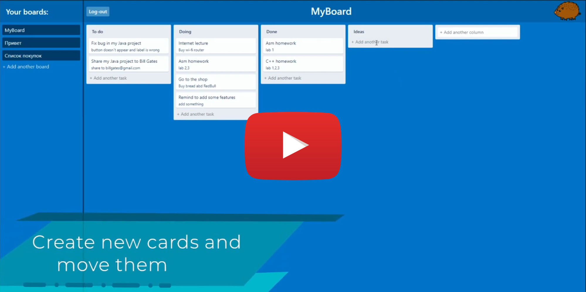
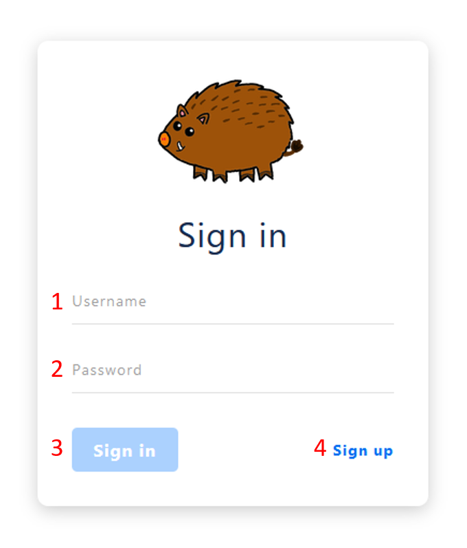
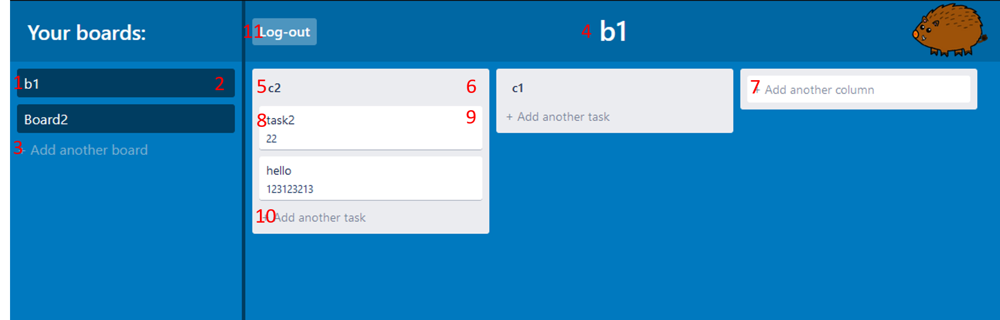
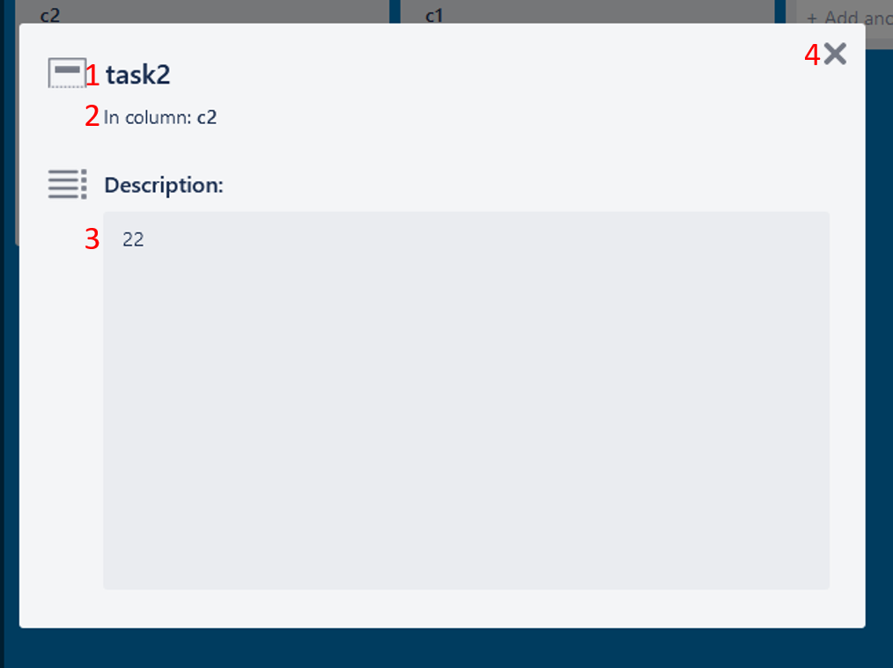

# BKabanBoard

BKabanBoard is my first web application.

This app is a simple online kanban board (Trello clone).

Client was implemented on Vue.js; Server - on ASP.NET Core and Spring Boot.

## Table of contetnts

- [About](#bkabanboard)
- [Demo](#demo)
- [Main Features](#main-features)
- [Technologies](#technologies)
- [Notes](#notes)
- [User interface](#user-interface)
  - [Sign in](#sign-in)
  - [Board](#board)
  - [Task edit](#task-edit)

## Demo

ASP.NET Core backend: [kban.tk](https://kban.tk/).

Spring boot backend: [jkban.tk](https://jkban.tk/#/).

Please use Firefox. Doesn't work on chrome

## Main Features

- Registration
- Signing in

- ### Boards
  - Create new boards
  - Rename boards
  - Delete boards
  - Reorder boards using drag & drop
- ### Columns
  - Create new columns in boards
  - Rename columns
  - Delete columns
  - Reorder columns using drag & drop
- ### Tasks
  - Create new tasks in columns
  - Change task name and description
  - Delete tasks
  - Reorder tasks using drag & drop
  - Move tasks between columns using drag & drop

## Technologies

- ### Back-end
  - [ASP.NET Core](https://github.com/dotnet/aspnetcore) Web API
  - [Dapper](https://github.com/DapperLib/Dapper)
  - [Spring boot](https://github.com/spring-projects/spring-boot) (I also decided to implement back-end in java)
- ### Front-end
  - [Vue.js](https://github.com/vuejs/vue) 2
  - [axios](https://github.com/axios/axios) used for http requests
  - [Vue.Draggable](https://github.com/SortableJS/Vue.Draggable) used for drag&drop

## Notes

- Design was just cloned from Trello
- Authentication was implemented using sessions, it was a bad idea; I should have to implement this using JWT
- For now authentication does not work in Chrome because `cookies with SameSite=None must now also specify the Secure attribute;` but it works in Firefox

## User interface

### Sign in

1. Username field
2. Password field
3. Sign in button
4. Sign up button, click to create an account

### Board

1. Card of the board
   - Click to open the board
   - Boards can be reordered using drag & drop
2. Delete button. It will appear here when you hover over the card
3. Field to add a board. Type name and press enter to add a board
4. Name of the board. Click here to rename it

---

5. Column
   - Columns can contain tasks
   - Columns can be reordered using drag & drop
   - Click on header to rename column
6. Delete button. It will appear here when you hover over the column header
7. Field to add a column. Type name and press enter to add a column

---

8. Task
   - Task has name and description
   - Tasks can be reordered using drag & drop
   - Tasks can be moved between columns using drag & drop
   - Click on the card to rename it or change description
9. Delete button. It will appear here when you hover over the task
10. Field to add a task. Type name and press enter to add a task

---

11. Sign out button

### Task edit

1. Name of the task. Click to edit
2. Column name where task is located.
3. Task description. Click to edit
4. Save & exit button
